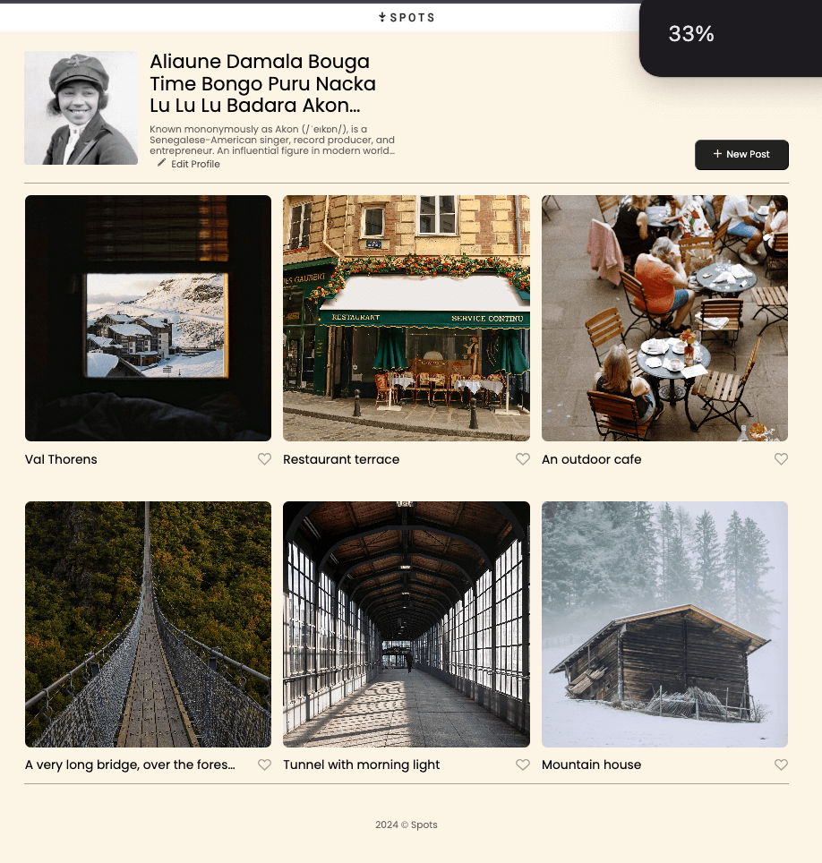

# Project 3: Spots

### Overview

- Intro
- Figma
- Images

**Intro**

This project is designed so all the elements are displayed correctly on popular screen sizes. All elements are based on the figma project linked below. Elements are resposive and change slightly according to screen size. Ellipses are added to text to ensure all text adheres to figma design specifications. [Link to project GitHub page](https://jess-long.github.io/se_project_spots/)

**Figma**

- [Link to the project on Figma](https://www.figma.com/file/BBNm2bC3lj8QQMHlnqRsga/Sprint-3-Project-%E2%80%94-Spots?type=design&node-id=2%3A60&mode=design&t=afgNFybdorZO6cQo-1)

**Images**  

[webpage video](https://www.loom.com/share/678c892c31c64e219884860427b7fab1?sid=9a2ae484-8c46-454d-be79-01d6b2bbc03f)
